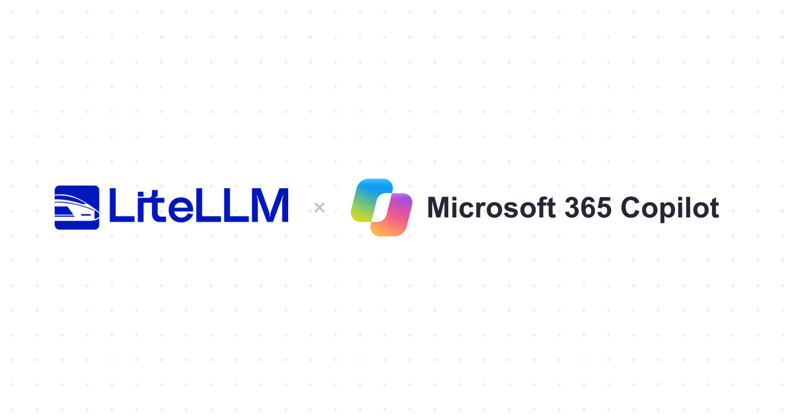

import CopilotHero from './CopilotHero';

export const Hero = CopilotHero;

**Microsoft 365 Copilot is now a provider in LiteLLM.** Use it from your applications to ask questions about your Microsoft 365 work data.

Users sign in with their Microsoft work account and ask questions like “Summarize my latest meeting.” Copilot answers using the data they already have permission to access.

{/* truncate */}

Connect applications that support Microsoft Entra SSO and forward each user's access token. Each user needs a Microsoft 365 Copilot license, and LiteLLM requires enterprise JWT authentication.

Admins can set [custom pricing](https://docs.litellm.ai/docs/proxy/custom_pricing#override-model-cost-map) to track usage costs.

[Set up Microsoft 365 Copilot →](/docs/providers/microsoft_365_copilot)
