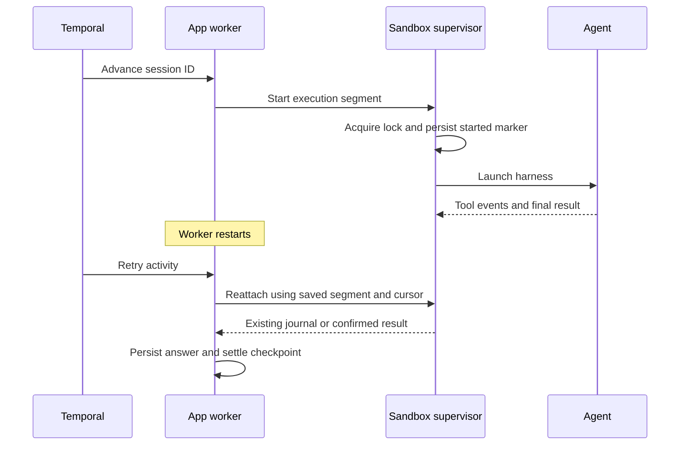

import {GuideNav} from '@site/src/components/Moyai';

<GuideNav active="architecture" />

Moyai separates the lifetime of a conversation from the machine executing its current task. The web app owns identity, messages, app connections, and execution records. A sandbox runs the agent. LiteLLM handles model access and inference accounting.

This guide describes the Modal quickstart and the Render plus Temporal layout used by the LiteLLM team. Implementation links refer to Moyai commit [`04ea562`](https://github.com/BerriAI/moyai/tree/04ea5627419c1cdcce1532667d95ba1956df8e30). Consult the upstream [deployment guide](https://github.com/BerriAI/moyai/blob/main/docs/deployment.md) before operating another revision or sandbox provider.

## System design

[Open the full-size diagram](./architecture.svg). Lines describe request paths, not unrestricted network permissions. The diagram shows Modal sandboxes; Moyai also has other [sandbox providers](https://github.com/BerriAI/moyai/blob/main/docs/deployment.md).

| Component | Contribution | Persistent state |
|---|---|---|
| Web app and broker | Authenticate users, accept messages, enforce connection policies, broker model and app calls | Chat, messages, connection records, request accounting |
| Agent harness | Run the model/tool loop with the selected native API | Harness-specific history and public working context |
| Sandbox | Supply the terminal, files, and browser for the agent | Files saved in provider snapshots; live processes remain on the machine |
| LiteLLM gateway | Route model requests, hold provider keys, enforce key budgets, record inference cost | Gateway spend logs and model configuration |
| Temporal, when enabled | Schedule the next session step, timers, and activity retries | Session IDs and small lifecycle values, not prompts, files, or credentials |

## Two deployment layouts

### Default: Modal app and sandboxes

The [setup guide](./setup.md) uses `deploy_modal.py` to host one web container on Modal. It provisions separate sandboxes for agent work. You do not need Render or Temporal to complete that guide.

The app runs SQLite on its local disk and commits complete database snapshots and result archives to a Modal Volume. It checkpoints API mutations before acknowledging them and checkpoints background activity about every two seconds. A hard failure can lose the newest background events.

After replacement, the app restores its last committed snapshot and marks unfinished tasks interrupted. It does not replay their external writes. Send a new message to continue from the last saved workspace. Keep `min_containers=1`, `max_containers=1`, and recreate deployment; this SQLite layout does not support multiple writers or rolling deployment. Redeployments interrupt active tasks.

Source: [Modal deployment](https://github.com/BerriAI/moyai/blob/04ea5627419c1cdcce1532667d95ba1956df8e30/deploy_modal.py) and [state persistence](https://github.com/BerriAI/moyai/blob/04ea5627419c1cdcce1532667d95ba1956df8e30/docs/deployment.md#deploy-the-control-plane).

### Optional: Render app, Temporal orchestration, Modal sandboxes

Render hosts the web app, broker, SQLite database, and one shared Temporal worker. Modal hosts the independent agent machines. Temporal runs a workflow for each session and asks the worker to advance it through bounded activities.

Keep the worker in the same Render service as the web app so both use the same database and result archives. One worker can coordinate multiple sessions; there is no worker container per agent. Scaling the control plane requires a shared database and artifact store first.

A restarted worker can reconnect to a surviving sandbox and read its execution journal. Temporal cannot replace the application database or restore a lost disk. Back up that disk and preserve the encryption and session keys.

## One task, from message to answer

1. **Accept the message.** The app authenticates a web request or verifies a Slack event, finds the session, and commits the message. With Temporal enabled, it signals the session workflow.
2. **Prepare execution.** The worker loads the recorded phase, provisions or reuses a sandbox, and issues a fresh capability scoped to the run. The selected harness and model determine the gateway API.
3. **Run tools and inference.** The harness executes code in the sandbox. Model and connected-app requests pass through the broker. The app records activity and inference identity against the requesting user and message.
4. **Save progress.** At a supported safe boundary, the runtime saves conversation state and files. It retains pending tool records so a missing result cannot masquerade as success.
5. **Settle the response.** The app persists the final answer before collecting artifacts and taking the final snapshot. Web chat can show the answer while saving continues. Slack delivery and queued follow-ups wait for settlement.

The response passes through `queued`, `provisioning`, `running`, `saving`, and `idle` (shown as **Ready**). A queued follow-up keeps the same session ID and starts after the preceding response settles.

## State and checkpoints

| State | Location | Recovery use |
|---|---|---|
| Conversation and execution phase | App SQLite and its deployment-specific backup | Find the session, queued messages, sandbox, and journal cursor |
| Workspace files | Sandbox filesystem plus provider snapshot | Restore saved files on a replacement machine |
| Public working context | `/session/context.sqlite3`, included with workspace snapshots | Restore the summary, recent journal entries, and unresolved tool records |
| Native harness history | Harness-specific saved state | Reuse only when that adapter's compatibility, privacy, and checkpoint gates permit |
| Execution journal and result | Detached supervisor's segment directory in the sandbox | Reattach after worker disconnect and consume events from the saved cursor |
| Workflow progress | Temporal history | Retry coordination and schedule waits; does not contain the workspace |

### Checkpoint only at a safe boundary

In the documented Temporal/Hermes flow, Moyai requests a periodic checkpoint every ten minutes by default. Hermes reaches the next safe boundary between tool rounds before saving. A running tool can delay that checkpoint.

For Modal's 24-hour sandbox limit, Moyai requests renewal after 23 hours. It requires saved conversation state, a filesystem snapshot, settled tool outcomes, and confirmation that the old machine stopped before continuing the turn on a replacement. A tool that cannot reach that boundary before the hard limit can still be interrupted. Other harnesses expose their own lifecycle hooks; check the [harness guide](https://github.com/BerriAI/moyai/blob/main/docs/harnesses.md) before assuming the same checkpoint behavior.

A completed top-level Temporal session keeps its sandbox warm for `SANDBOX_IDLE_SECONDS=300` after the message queue drains. A follow-up in that window reuses the machine with a fresh capability. After release, a new sandbox restores the saved checkpoint. Warm machines consume compute; saved snapshots can incur storage charges.

Filesystem snapshots preserve files, not RAM or running processes. Browser continuity uses separate restoration mechanisms; do not treat a filesystem snapshot as a live browser backup.

### Keep context bounded without losing tool status

The public context store keeps an append-only scrubbed journal, a model-generated summary, and an atomic coverage cursor. The summary covers a known prefix; resumed context combines it with recent indexed entries. Full receipts remain available through bounded reads.

A separate pending-tool ledger tracks calls without confirmed results. Summarization does not clear those records. If an outcome is unknown, restored context tells the agent to inspect original records, workspace state, and external receipts before repeating the action.

Harness resume differs. Codex starts a fresh ephemeral native thread with restored public context. Claude Agent SDK and OpenCode can reuse completed native state only through the adapter's reuse gates. Hermes has its own history flow. Changing the model or requester can require a checkpointed handoff to update capability and private context scope.

Sources: [context store](https://github.com/BerriAI/moyai/blob/04ea5627419c1cdcce1532667d95ba1956df8e30/sandbox/context_store.py), [context recovery](https://github.com/BerriAI/moyai/blob/04ea5627419c1cdcce1532667d95ba1956df8e30/sandbox/context_recovery.py), and [native sessions](https://github.com/BerriAI/moyai/blob/04ea5627419c1cdcce1532667d95ba1956df8e30/sandbox/native_session.py).

## Worker recovery and tool recovery

### Reconnect to a surviving execution

The supervisor holds an exclusive lock during execution and writes a durable `started.json` marker before launching the harness. It writes results atomically. A retry with the same segment identity reattaches to that supervisor instead of launching a second agent.

The lock establishes whether a supervisor owns the execution now. The marker records that a launch may have happened before. If the marker exists without a live owner or confirmed result, Moyai reports an interruption. Repeating the launch could repeat a tool that already changed an external system.

Sources: [supervisor launch guard](https://github.com/BerriAI/moyai/blob/04ea5627419c1cdcce1532667d95ba1956df8e30/sandbox/durable_process.py), [durable runner](https://github.com/BerriAI/moyai/blob/04ea5627419c1cdcce1532667d95ba1956df8e30/app/durable_runner.py), and [Temporal runtime](https://github.com/BerriAI/moyai/blob/04ea5627419c1cdcce1532667d95ba1956df8e30/app/temporal_runtime.py).

### Handle failures according to the evidence

| Failure | Moyai's response | Operator or user action |
|---|---|---|
| Modal quickstart web container replaced | Restore the app snapshot and interrupt unfinished work | Send an explicit follow-up from the last saved workspace |
| Temporal worker restarts; sandbox survives | Reattach to the recorded segment and read its journal | Inspect activity while the worker reconnects |
| Sandbox disappears during uncertain work | Interrupt; retain the last safe checkpoint | Inspect files and external receipts before asking to continue |
| Started marker exists with no live owner or result | Stop without launching the segment again | Investigate whether a write already completed |
| Final answer exists but workspace save fails | Preserve the answer with a warning, keep the previous snapshot, cancel queued follow-ups | Check the saved files and warning before continuing |
| Connected-app write loses its response | Keep the outcome uncertain; a missing result does not prove failure | Check the destination or publication receipt before retrying |
| Slack outbox send has an uncertain outcome | Do not retry that uncertain send automatically | Check the thread before requesting another delivery |
| Transient startup read fails before execution | Retry reads; Temporal can use a bounded startup recovery window when pre-execution checks pass | Correct permanent authentication/configuration errors |

**Temporal activities run at least once. Moyai does not promise exactly-once external side effects.** Stop revokes the run capability and requests cleanup; it cannot undo a write an external service has accepted. Retrying a model request can also incur another inference charge.

For executable examples of these failure boundaries, see the upstream [durability tests](https://github.com/BerriAI/moyai/blob/04ea5627419c1cdcce1532667d95ba1956df8e30/tests/test_durable.py) and [context tests](https://github.com/BerriAI/moyai/blob/04ea5627419c1cdcce1532667d95ba1956df8e30/tests/test_context_store.py).

## Credentials and access boundaries

Provider API keys stay at LiteLLM. The Moyai app holds the gateway key and encrypted connected-app credentials. A sandbox receives a run-scoped capability for the broker; the broker checks the run and connection policy before forwarding requests.

Enabled connected-app tools execute under the connection policy without an administrator approval step. Some operations have additional consent gates, such as editing an external PR from a saved chat. A paused or read-only connection blocks new writes. These shared connections retain the permissions of their authorizing identity. Moyai's shared workspace is intended for trusted teammates, not isolated tenants.

The default Modal sandbox uses container isolation; optional VM execution is a separate configuration. Do not assume a blanket sandbox egress allowlist. Repository code and prompts can leave your cloud through the model provider you choose. See [security and scope](https://github.com/BerriAI/moyai/blob/main/docs/security-and-scope.md) before expanding access.

## Cost accounting {#cost-accounting}

Moyai uses LiteLLM as the source of truth for model costs. It stores the gateway's final charge for each tracked request and sums those same charges by user, session, and model. It preserves decimal precision instead of estimating prices from token counts.

Moyai reserves a request identity before inference and attributes usage to the original user, message, session, and model. It captures final response costs for non-streaming requests and final usage costs for streams; an initial stream header is not a final bill.

If a receipt is missing, background recovery can query LiteLLM's `/spend/logs/v2` using the same gateway key with the added permission. This recovers accounting without rerunning inference or changing an interrupted task's execution status. Unknown costs remain visible. Keep provider inference and hosting/storage charges distinct when evaluating the installation.

The totals cover tracked Moyai requests with recorded costs. Calls outside Moyai, gateway-internal billed attempts absent from returned costs, and unresolved receipts can leave a difference from the gateway key's total. Use the dashboard's coverage and per-request amounts when reconciling spend.

See [costs and receipt recovery](https://github.com/BerriAI/moyai/blob/main/docs/costs.md) and [the setup spend check](./setup.md#track-spend).
