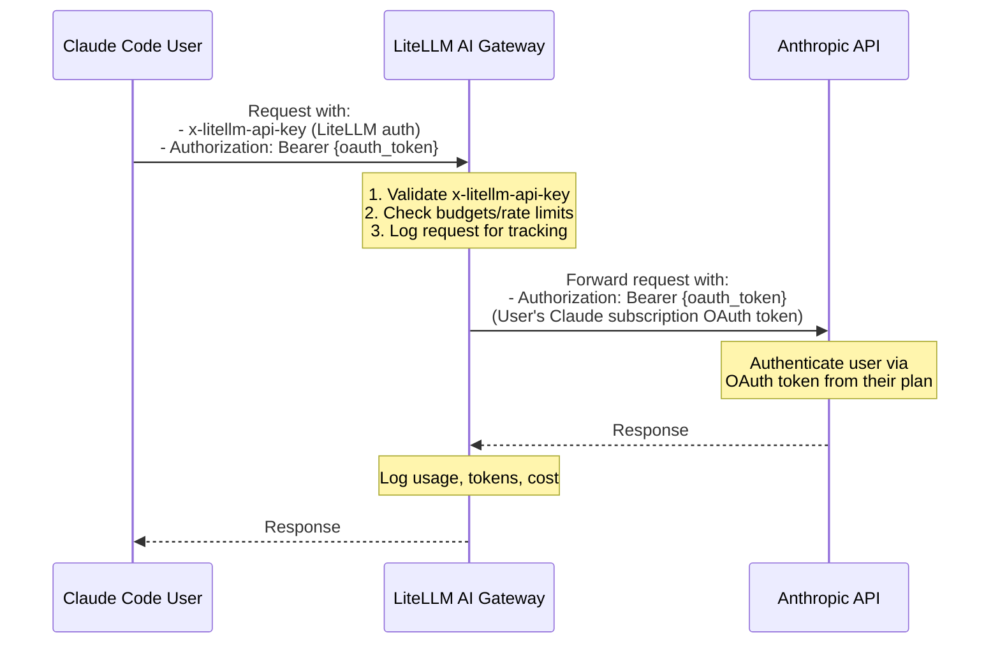

import Image from '@theme/IdealImage';
import Tabs from '@theme/Tabs';
import TabItem from '@theme/TabItem';

# Using Claude Code with a Claude Subscription (Pro, Max, Team, Enterprise)

<div style={{ textAlign: 'center' }}>
<Image img={require('../../img/claude_code_max.png')} style={{ width: '100%', maxWidth: '800px', height: 'auto' }} />

Route Claude Code traffic signed in with a Claude Pro, Max, Team, or Enterprise subscription through LiteLLM AI Gateway.
</div>

**Why a Claude subscription over direct API?**
- **Lower costs**: Claude subscriptions are cheaper for Claude Code power users than per-token API pricing

**Why route through LiteLLM?**
- **Cost attribution**: Track spend per user, team, or key
- **Budgets & rate limits**: Set spending caps and request limits
- **Guardrails**: Apply content filtering and safety controls to all requests


## Quick Start Video

Watch the end-to-end walkthrough of setting up Claude Code with LiteLLM Gateway:

<iframe width="840" height="500" src="https://www.loom.com/embed/2d069b9e3bcc4cecaa5eb27a72ba7b3c" frameBorder="0" allowFullScreen></iframe>

## Prerequisites

- [Claude Code](https://code.claude.com/docs/en/overview) installed
- A Claude Pro, Max, Team, or Enterprise subscription (Team and Enterprise members sign in with the Claude account their admin invited)
- LiteLLM Gateway v1.81.14 or later
- A PostgreSQL database for the proxy, which the Dashboard needs for virtual keys and logs

## Step 1: Configure LiteLLM Proxy

Create a `config.yaml` that routes every Claude model to Anthropic:

```yaml showLineNumbers title="config.yaml"
model_list:
  - model_name: "anthropic/*"
    litellm_params:
      model: "anthropic/*"

general_settings:
  master_key: os.environ/LITELLM_MASTER_KEY
  database_url: os.environ/DATABASE_URL
```

Claude Code asks for Claude model ids such as `{{anthropic}}`, and the model depends on your plan and on what you pick with `/model`. The `anthropic/*` wildcard routes whichever Claude model Claude Code asks for, so you do not need a `model_name` per model. The Dashboard steps below need the `database_url`.

:::info[No header forwarding setting is needed]

Since v1.81.14, LiteLLM forwards a client's `Authorization: Bearer sk-ant-oat...` subscription token to `anthropic/` deployments without `forward_client_headers_to_llm_api`. The token takes precedence over any `api_key` set on the deployment, and LiteLLM adds the `anthropic-beta: oauth-2025-04-20` header Anthropic requires for OAuth. Turn on `forward_client_headers_to_llm_api` only if you also want other client headers forwarded.

A deployment without an `api_key` serves only subscription users: a request that arrives without a subscription token fails with `401 Missing Anthropic API Key`. If you set an `api_key`, requests without a token fall back to it and are billed to that API key.

:::

## Step 2: Start LiteLLM Proxy

```bash showLineNumbers title="Start LiteLLM Proxy"
export LITELLM_MASTER_KEY="sk-<a-long-random-key>"
export DATABASE_URL="postgresql://<user>:<password>@<host>:5432/<database>"
litellm --config /path/to/config.yaml

# RUNNING on http://0.0.0.0:4000
```

## Walkthrough

The screenshots below are from LiteLLM v1.104.2 and Claude Code v2.1.296.

### Part 1: Create a Virtual Key in LiteLLM

Create a virtual key in the LiteLLM Dashboard for Claude Code to use.

#### 1.1 Open the Virtual Keys Page

Open the Dashboard at `http://localhost:4000/ui`, sign in with the username `admin` and your master key as the password, and go to **Virtual Keys**.

<Image img={require('../../img/claude_code_max/virtual-keys-page.png')} style={{ width: '800px', height: 'auto' }} />

#### 1.2 Click "Create New Key"

Click **+ Create New Key**. Leave **Owned By** set to **You** and enter a **Key Name**, for example `claude-code-test`.

<Image img={require('../../img/claude_code_max/create-key-modal.png')} style={{ width: '800px', height: 'auto' }} />

#### 1.3 Select Models

Open **Models** and pick **All anthropic models**. It matches the `anthropic/*` wildcard in your config, so the key can call every Claude model and nothing else. If you leave **Models** empty, the key can call every model on the proxy.

<Image img={require('../../img/claude_code_max/models-dropdown.png')} style={{ width: '800px', height: 'auto' }} />

<Image img={require('../../img/claude_code_max/models-selected.png')} style={{ width: '800px', height: 'auto' }} />

#### 1.4 Create the Key

Scroll to the bottom of the form and click **Create Key**. Copy the virtual key from the **Save your Key** dialog, since the Dashboard shows it only once.

<Image img={require('../../img/claude_code_max/key-created.png')} style={{ width: '800px', height: 'auto' }} />

---

### Part 2: Sign into Claude Code with Your Subscription (Client Side)

Point Claude Code at LiteLLM Gateway and sign in with your Claude subscription.

#### 2.1 Set Environment Variables

Configure Claude Code to use LiteLLM Gateway with your virtual key:

```bash showLineNumbers title="Configure Claude Code Environment Variables"
export ANTHROPIC_BASE_URL=http://localhost:4000
export ANTHROPIC_CUSTOM_HEADERS="x-litellm-api-key: Bearer sk-<your-virtual-key>"
```

#### Environment Variables Explained

| Variable | Description |
|----------|-------------|
| `ANTHROPIC_BASE_URL` | Points Claude Code to your LiteLLM Gateway endpoint |
| `ANTHROPIC_CUSTOM_HEADERS` | The `x-litellm-api-key` header for LiteLLM authentication |

You do not need `ANTHROPIC_MODEL`. Claude Code uses your plan's default model, `/model` switches it, and the wildcard in Step 1 routes either one. If you do set `ANTHROPIC_MODEL`, use a Claude model id such as `{{anthropic_large}}` rather than a custom alias, because Claude Code warns about model names it does not recognize.

Do not also set `ANTHROPIC_AUTH_TOKEN`, `ANTHROPIC_API_KEY`, or an `apiKeyHelper`. Claude Code sends any of those in place of the subscription login, so the request no longer uses the subscription.

#### 2.2 Launch Claude Code

Start Claude Code in your project folder:

```bash showLineNumbers title="Launch Claude Code"
claude
```

On the first run, Claude Code asks you to choose a text style. Pick one and press Enter.

<Image img={require('../../img/claude_code_max/claude-code-theme.png')} style={{ width: '800px', height: 'auto' }} />

#### 2.3 Select Login Method

Choose **Claude account with subscription** (Pro, Max, Team, or Enterprise).

<Image img={require('../../img/claude_code_max/claude-code-login-method.png')} style={{ width: '800px', height: 'auto' }} />

#### 2.4 Sign In in Your Browser

Claude Code opens claude.com in your browser. Sign in with the Claude account that has your subscription and approve the access request. If the browser shows a code, paste it at the **Paste code here if prompted** line. If the browser does not open, press `c` to copy the sign-in URL and open it yourself.

<Image img={require('../../img/claude_code_max/claude-code-sign-in.png')} style={{ width: '800px', height: 'auto' }} />

#### 2.5 Trust the Project Folder

After sign-in, press Enter through the remaining setup screens. Claude Code then asks whether you trust the current folder; choose **Yes, I trust this folder**.

<Image img={require('../../img/claude_code_max/claude-code-trust-folder.png')} style={{ width: '800px', height: 'auto' }} />

---

### Part 3: Use Claude Code with LiteLLM

Now you can use Claude Code normally, and LiteLLM tracks every request.

#### 3.1 Make a Request in Claude Code

Use Claude Code as usual. The header shows the model and your plan, and every request goes through LiteLLM Gateway.

<Image img={require('../../img/claude_code_max/claude-code-request.png')} style={{ width: '800px', height: 'auto' }} />

#### 3.2 View Logs in LiteLLM Dashboard

Open **Logs** in the Dashboard. The requests from one Claude Code session are grouped into one row, which shows the number of requests and the session's total cost and duration.

<Image img={require('../../img/claude_code_max/logs-page.png')} style={{ width: '800px', height: 'auto' }} />

#### 3.3 View Request Details

Click the row to open the session. The left side lists each request in the session, and the right side shows the selected request.

<Image img={require('../../img/claude_code_max/request-details.png')} style={{ width: '800px', height: 'auto' }} />

The request details show:
- **Key Alias** (on the Logs page): `claude-code-test`, the virtual key you created
- **Model**: the Claude model Claude Code used, for example `anthropic/claude-opus-5-5`
- **Tokens**: input, output, and prompt cache tokens
- **Cost**: calculated at Anthropic API list prices, see [Attribution and cost](#attribution-and-cost)
- **Tags**: Claude Code's `User-Agent`, for example `claude-cli/2.1.296`
- **Status**: Success

---

## How It Works

LiteLLM Gateway handles two types of authentication:
1. **`x-litellm-api-key`**: Authenticates the request with LiteLLM (usage tracking, budgets, rate limits)
2. **OAuth Token (via `Authorization` header)**: Forwarded to Anthropic API for Claude subscription authentication



### Header Flow

| Header | Purpose | Handled By |
|--------|---------|------------|
| `x-litellm-api-key` | LiteLLM Gateway authentication, budget tracking, rate limits | LiteLLM |
| `Authorization: Bearer {oauth_token}` | Claude subscription authentication | Anthropic API |

### Complete Request Flow Example

Here's what a typical request looks like when Claude Code makes a call through LiteLLM:

```bash showLineNumbers title="Example Request from Claude Code to LiteLLM"
curl -X POST "http://localhost:4000/v1/messages" \
  -H "x-litellm-api-key: Bearer sk-<your-virtual-key>" \
  -H "Authorization: Bearer sk-ant-oat01-..." \
  -H "Content-Type: application/json" \
  -d '{
    "model": "{{anthropic}}",
    "max_tokens": 1024,
    "messages": [{"role": "user", "content": "Hello, Claude!"}]
  }'
```

LiteLLM then:
1. Validates `x-litellm-api-key` for gateway access
2. Logs the request for usage tracking
3. Forwards the request to Anthropic with the OAuth `Authorization` header in place of any configured `x-api-key`

## Plans, Credentials, and Attribution

### Supported plans

LiteLLM does not check which plan issued the token. Pro, Max, Team, and Enterprise logins all give Claude Code an `sk-ant-oat` OAuth token, and LiteLLM handles every one of them the same way. Plan limits, usage reporting, and billing are applied by Anthropic to the Claude account that signed in, and Team and Enterprise admin controls such as seat assignment, SSO, and member removal stay in Claude's admin console. To keep members on your organization instead of a personal account, set Claude Code's `forceLoginOrgUUID` [setting](https://code.claude.com/docs/en/authentication#restrict-login-to-your-organization).

Anthropic's [Legal and compliance](https://code.claude.com/docs/en/legal-and-compliance) page restricts using subscription credentials on behalf of other users. Each developer signs in with their own account and LiteLLM passes that token through per request; do not put a subscription token in a deployment's `api_key` to share it.

### Which requests use the subscription token

The token is forwarded on `/v1/messages` and on `/v1/chat/completions` when the model is an `anthropic/` deployment. It is never sent to other providers, including Claude on Bedrock or Vertex AI, which keep using their own credentials (since v1.99.0). `/v1/messages/count_tokens` uses the deployment's configured key, not the subscription token. The `/anthropic` pass-through route does not use the subscription token when the proxy has an Anthropic key configured, so point `ANTHROPIC_BASE_URL` at the proxy root as shown above rather than at `/anthropic`.

### Credential storage, refresh, and revocation

Claude Code owns the subscription credential. It stores the login locally (the macOS Keychain, or `~/.claude/.credentials.json` on Linux and Windows, under `CLAUDE_CONFIG_DIR` when that is set), refreshes it on its own, and `/logout` signs it out. LiteLLM stores nothing: the token is used for the one upstream request it arrived with, it is not cached across requests, and it is not written to logs or spend logs (spend logs record only whether one was used, see [Seeing Which Requests Were Billed to a Seat](#seeing-which-requests-were-billed-to-a-seat)). Concurrent requests from different users each go upstream with their own token.

When a token is expired or revoked, Anthropic answers `401 OAuth access token is invalid.` and LiteLLM returns that to Claude Code; the user runs `/login` again. LiteLLM cannot revoke a Claude login. To cut a user off at the gateway, [block](/docs/proxy/virtual_keys) or delete their virtual key, which stops their requests through LiteLLM; their Claude login itself still works directly against Anthropic until they or their admin remove it.

One user's expired or revoked token can currently block everyone else on the same model. LiteLLM counts the upstream 401 as a deployment failure and puts the deployment into cooldown, and while the cooldown lasts every other user's request to that model fails with `429 No deployments available for selected model` without reaching Anthropic. On proxies that serve subscription users, turn cooldowns off:

```yaml showLineNumbers title="config.yaml - Keep one user's 401 from blocking others"
router_settings:
  disable_cooldowns: true
```

### Attribution and cost

Spend is attributed to the virtual key in `x-litellm-api-key` and the user and team it belongs to, so per-user and per-team reporting, budgets, and rate limits work as usual. LiteLLM does not see which Claude account or organization the token belongs to. Cost is calculated at Anthropic API list prices and counts toward key, user, and team budgets even though Anthropic bills the usage to the subscription, so treat budgets here as usage caps in API-equivalent dollars.

To tell subscription-billed requests from key-billed ones, see [Seeing Which Requests Were Billed to a Seat](#seeing-which-requests-were-billed-to-a-seat).

## Advanced Configuration

### Per-Model Header Forwarding

The subscription token is forwarded without this setting. If you also want other client headers forwarded, you can enable header forwarding only for specific models:

```yaml showLineNumbers title="config.yaml - Per-Model Header Forwarding"
model_list:
  - model_name: anthropic-claude
    litellm_params:
      model: anthropic/{{anthropic}}

  - model_name: {{anthropic_large}}
    litellm_params:
      model: anthropic/{{anthropic_large}}

general_settings:
  master_key: os.environ/LITELLM_MASTER_KEY

litellm_settings:
  model_group_settings:
    forward_client_headers_to_llm_api:
      - anthropic-claude
      - {{anthropic_large}}
```

### Budget Controls

Set up per-user budgets while using Claude subscriptions (cost is tracked at API list prices, see [Attribution and cost](#attribution-and-cost)). With the `database_url` from Step 1 in place, create virtual keys with budgets:

```bash showLineNumbers title="Create Virtual Key with Budget"
curl -X POST "http://localhost:4000/key/generate" \
  -H "Authorization: Bearer $LITELLM_MASTER_KEY" \
  -H "Content-Type: application/json" \
  -d '{
    "key_alias": "developer-1",
    "max_budget": 100.00,
    "budget_duration": "monthly"
  }'
```

### Seeing Which Requests Were Billed to a Seat

Every spend log row records which credential the upstream call used in `metadata.used_client_oauth_token`: `true` when the request went to Anthropic with the developer's forwarded OAuth token (the subscription seat paid for it), `false` when it went out with the deployment's configured `api_key`. The token itself is never written to the log. The field needs LiteLLM v1.105.0 or later (first in `v1.105.0-rc.1`), and rows written by an earlier version have no value, so they match neither filter below. A request the router sends to a Bedrock or Vertex deployment reads `false` even when the client sent an OAuth token, since only the direct Anthropic route forwards it. Requests through the `/anthropic` pass-through route do not carry the field

`spend` stays at the model's list price on both kinds of rows, so budgets and rate limits keep working across seat-billed and key-billed traffic. To get the real API bill, subtract the seat-billed rows

Filter the Logs page at `http://localhost:4000/ui/?page=logs` with the **Credential** dropdown (**Client OAuth token** or **Configured key**); the row's detail drawer shows the same value under Request Details. The same filter is available on the spend logs API:

```bash showLineNumbers title="List Seat-Billed Requests"
curl "http://localhost:4000/spend/logs/ui?used_client_oauth_token=true" \
  -H "Authorization: Bearer $LITELLM_MASTER_KEY"
```

Pass `used_client_oauth_token=false` for the requests the configured key paid for

## Troubleshooting

### OAuth Token Not Being Forwarded

**Symptom**: Authentication errors from Anthropic API, or usage billed to the configured API key instead of the subscription

**Solution**: Check that you are on LiteLLM v1.81.14 or later, that the model is an `anthropic/` deployment, and that Claude Code reaches the proxy root (`/v1/messages`) rather than `/anthropic`. In Claude Code, `/status` shows the active login; if `ANTHROPIC_AUTH_TOKEN`, `ANTHROPIC_API_KEY`, or an `apiKeyHelper` is set, Claude Code sends that instead of the subscription token. A `401 OAuth access token is invalid.` means the login expired or was revoked; run `/login`.

### LiteLLM Authentication Failing

**Symptom**: 401 errors from LiteLLM Gateway

**Solution**: Verify the `x-litellm-api-key` header is set correctly in `ANTHROPIC_CUSTOM_HEADERS` by sending the same header yourself. A `200` means the key works; a `401` with `Invalid proxy server token passed` means the key is wrong or was deleted:

```bash showLineNumbers title="Verify the Virtual Key"
curl "http://localhost:4000/v1/models" \
  -H "x-litellm-api-key: Bearer sk-<your-virtual-key>"
```

### Model Not Found

**Symptom**: Model not found errors, or the key is not allowed to access the model

**Solution**: Check that the config has the `anthropic/*` wildcard from Step 1 (or a `model_name` for each model Claude Code asks for) and that the virtual key's **Models** include it; **All anthropic models** covers every Claude model. If you set `ANTHROPIC_MODEL`, it must be a model the proxy serves. List the models your key can call:

```bash showLineNumbers title="List Available Models"
curl "http://localhost:4000/v1/models" \
  -H "Authorization: Bearer sk-<your-virtual-key>"
```

## Related Documentation

- [Forward Client Headers](/docs/proxy/forward_client_headers) - Detailed header forwarding configuration
- [Claude Code Quickstart](/docs/tutorials/claude_responses_api) - Basic Claude Code + LiteLLM setup
- [Virtual Keys](/docs/proxy/virtual_keys) - Creating and managing API keys
- [Budgets & Rate Limits](/docs/proxy/users) - Setting up usage controls
